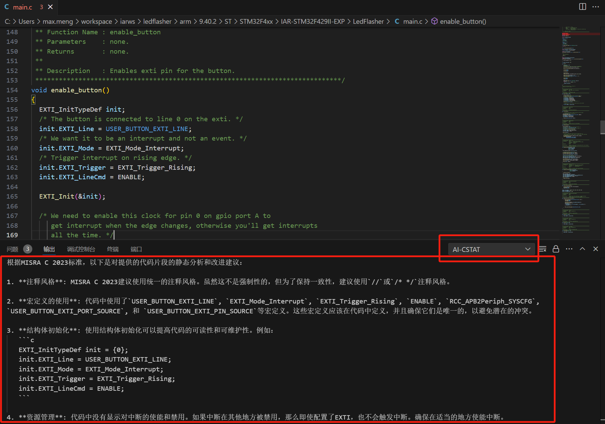

# kimi chat for C&C++ static analyze

This is the demo project for VScode plugin which call kimi chat API by javascript to do static analyze C & C++ code.

## Requirements

You need a kimi AI account, and get your API token at:
user account info/basic info:  
https://platform.moonshot.cn/console/info

We call this token as:  
[KIMI API KEY]

You also need to have a Microsoft account, login:  
https://login.live.com

Then access Azure DevOps:  
https://aka.ms/SignupAzureDevOps

In the User settings, get Personal access tokens:  

Create a new personal access token as:  
[AZURE DEV ACCESS TOKEN]

And don't forget to copy to some safe place:

You also need to create a visual studio publisher at:
https://marketplace.visualstudio.com/manage/createpublisher

## How to use
First, install KIMIAIVERIFY from market place.
Open any C/C++ source file, you can find "AI static check" in the right click menu:  

Or you can use CMD+shift+D keyboard short cut to call out this function.

The AI check result can be find at output log:

## Extension Settings

Include if your extension adds any VS Code settings through the `contributes.configuration` extension point.

For example:

This extension contributes the following settings:

* `myExtension.enable`: Enable/disable this extension.
* `myExtension.thing`: Set to `blah` to do something.

## Known Issues

One Kimi free user API can only support one API call everytime, it takes about 5 seconds to get first response.

## Release Notes

### 1.0.0

Initial release of KIMI AI for C/C++ static analyze VScode plugin

## For more information

**Enjoy!**
